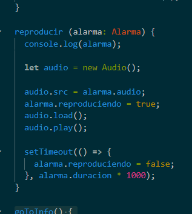
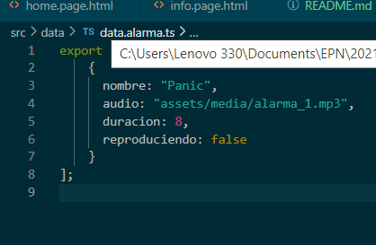
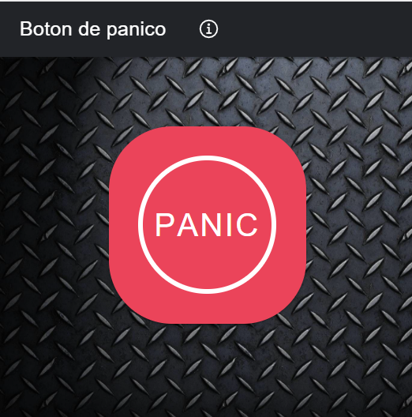

# Boton de Panico

### ¿Qué es Boton de panico?
Con esta sencilla aplicación podrás tener una alarma en tu teléfono en caso de estar en peligro de un asalto, tan simple como apretar un botón y subir el volumen de tu dispositivo al máximo para poder alertar a pobladores cercanos a ti.

### Funcion
Por el momento la app solo es una alerta de seguridad.
Por falta de credenciales de google no pude implementar la funcion de geolocalizacion, que se tiene planeado para enviar a contactos importantes del usuario
Originalmente queria usar Android Studio para la creacion del proyecto pero por falta de recursos en mi computadora opte por usar ionic y Angular

La aplicacion tiene dentro de su codigo el audio para evitar que se use esclusivamente con internet.
Tambien se tiene un boton que no tiene la funcion de detener el sonido ya que por concideracion mia si es que se esta en un asalto la alarma puede distraer o asustar al delincuente 

en la carpeta data se encuentra la direccion con la que se pude acceder a la ubicacion e informacion del audio.

  
